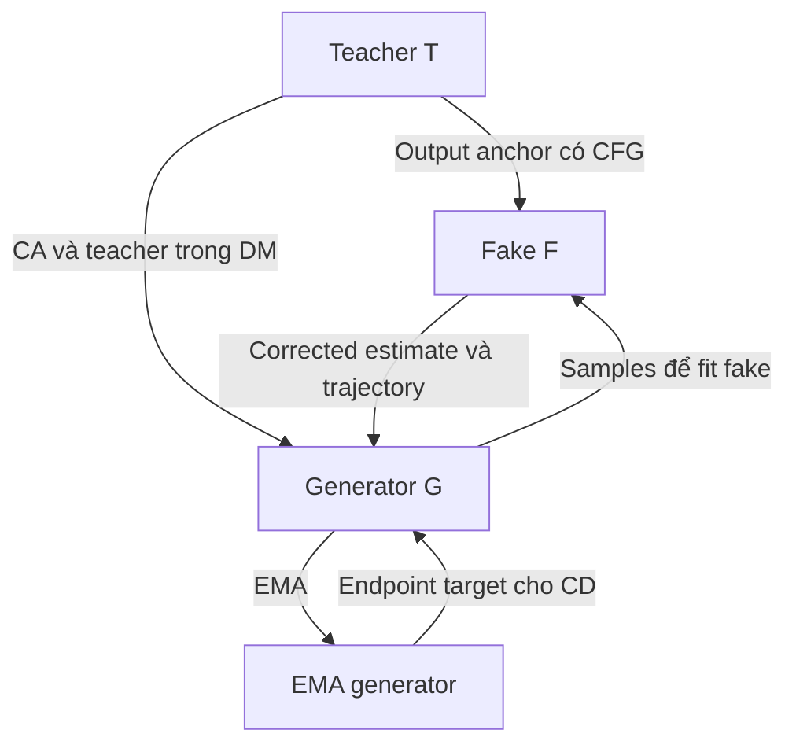

# Bàn giao GPT Work về distillation qua fake dynamics

Ngày chốt: 08 tháng 10 năm 2026.

## 0. Nhiệm vụ cho GPT Work

Bạn là cộng tác viên nghiên cứu và triển khai. Hãy dùng đặc tả này để xây dựng, kiểm tra và chuẩn bị chạy một phương pháp distillation SDXL 4 bước. Đọc code thực tế trước khi sửa; giữ nguyên các quyết định đã chốt dưới đây và phân biệt chúng với các tham số thử nghiệm.

Mục tiêu là có checkpoint cuối đạt benchmark tốt hơn số báo cáo của Decoupled DMD, ưu tiên FID < 17.80 với protocol đánh giá tương thích. Người dùng không chỉ muốn chứng minh update tốt hơn một baseline tự chạy ở cùng ngân sách.

Đây là phương pháp đề xuất, chưa có training run hoặc kết quả chứng minh hiệu quả. Không được trình bày các công thức lý tưởng như một định lý ổn định của toàn bộ hệ. Khi gặp mâu thuẫn giữa đặc tả và code, nêu rõ mâu thuẫn, sửa lỗi triển khai thông thường, và ghi lại quyết định có ảnh hưởng đến phương pháp hoặc benchmark.

Các đầu ra cần có: code thay đổi có thể review, config, lệnh train/eval phù hợp môi trường thật, kiểm tra gradient và sampler, checkpoint/log có thể resume, và bảng kết quả nếu có compute để chạy. Không bịa thời gian chạy, GPU-memory, số benchmark hoặc tình trạng đã thực nghiệm.

## 1. Bối cảnh và motivation

Ta có một teacher diffusion/flow-matching nhiều bước đã pretrained. Muốn tạo student sinh ảnh trong một hoặc vài bước, thường cùng architecture và có thể kế thừa weights teacher. Bản thử đầu tiên dùng SDXL 4 bước để tận dụng code và checkpoint công khai; generalization sang flow matching/video để sau.

DMD có generator G và fake score model F. G tạo samples; F học dự đoán denoising trên các samples đó. Sai khác teacher và fake tạo hướng cập nhật cho G. Trong cách nhìn thông thường, F chủ yếu phục vụ việc ước lượng score của phân phối generator.

Ý tưởng nghiên cứu là cho F một vai trò bổ sung: F trở thành dynamics trung gian để tạo trajectory targets cho G. F vẫn theo dõi G nhưng nhận một phần teacher-output supervision có CFG. Teacher ảnh hưởng G qua cả nhánh DMD trực tiếp và nhánh gián tiếp T → F → G.

Motivation ban đầu dùng hình ảnh một tam giác T, F, G và trực giác d(G,T) <= d(G,F)+d(F,T). Đây chỉ là cách diễn đạt quan hệ trung gian, không phải objective hay bằng chứng hội tụ; không cần biến nó thành một bất đẳng thức KL.

Vấn đề muốn giải quyết: distribution matching ràng buộc phân phối đầu ra, còn trajectory/consistency ràng buộc cách các bước liên hệ với nhau. Nếu ép G học trajectory trực tiếp của frozen teacher trong khi DMD đang tối ưu phân phối/coupling hiện tại của G, hai tín hiệu có thể không phù hợp nhau. Ta thử dùng một fake dynamics gần hành vi hiện tại của generator hơn, rồi đưa teacher vào fake từ từ.

Giả thuyết: generator có thể học dễ hơn từ một target trung gian thay đổi chậm, giúp giảm dao động hoặc xung đột gradient so với trajectory supervision trực tiếp từ teacher. Đây là giả thuyết cần đo, không phải kết quả đã biết.



### 1.1. Local score và finite-time generator

Có thể đổi epsilon, score, x0 prediction hoặc flow velocity bằng công thức affine phù hợp khi noisy state, timestep và scheduler đã cố định. Nhưng instantaneous velocity không tự động bằng average velocity trên một đoạn hữu hạn:

\[
\bar v_{t\to s}(x)
=\frac{\Phi^{t\to s}(x)-x}{s-t}
=\frac{1}{s-t}\int_t^s v(x_r,r)\,dr.
\]

Một phép đổi output x0/epsilon không chứng minh mạng đã học tích phân này. V0 dùng hai mạng F và G riêng biệt, cùng kiến trúc SDXL; chưa triển khai shared weights, hai head hay step-size conditioning. Quan điểm G/F là hai biểu diễn của cùng student là motivation dài hạn.

### 1.2. Đóng góp tiềm năng được giới hạn rõ

Điểm cần kiểm chứng là tổ hợp:

1. Fake vẫn fit samples từ G online.
2. Fake nhận một teacher-output anchor nhỏ có CFG.
3. Raw fake tạo transition cho consistency.
4. Fake estimate được hiệu chỉnh teacher bias trước khi đưa vào DM.
5. Teacher influence tăng chậm trong khi fake fitting vẫn đủ nhanh.

Không claim novelty chỉ từ việc cộng DMD với consistency, dùng EMA, hoặc để generator đồng thời dự đoán score. Các ý đó có prior art; xem mục 14.

## 2. Các quyết định đã chốt

- Backbone đầu tiên: SDXL, generator 4 bước.
- Warm start bằng checkpoint DMD2 đầy đủ, ưu tiên lấy cả generator và fake tương ứng.
- T freeze; F và G train độc lập; thêm EMA của G làm target consistency.
- Không có GAN loss trong giai đoạn training mới. Bỏ discriminator và phụ thuộc real-image data chỉ phục vụ GAN.
- Không merge weights F về teacher ở v0.
- Teacher supervision cho F được thực hiện trên noisy samples từ G; không tạo thêm teacher-image dataset nhiều bước.
- CFG áp dụng cho teacher; không CFG thêm một lần lên F hoặc generator inference.
- Direct generator objective giữ cấu trúc CA + DM với lịch re-noising riêng.
- Nhánh CD dùng transition của F, không dùng trực tiếp transition T.
- Giữ sampler inference/backsimulation của generator theo DMD2. DDIM deterministic của F chỉ dùng để tạo CD targets.
- Mục tiêu số chính: FID < 17.80 trên evaluation tương thích với SDXL 4-step COCO-10K của paper; báo cáo cả các metric khác.
- Không yêu cầu full matched-budget baseline retraining trước khi được đánh giá checkpoint mới.

Lưu ý nguồn gốc benchmark: Decoupled DMD Table 2 SDXL thực sự giữ GAN của DMD2 trong training, theo mục 4.3. Việc bỏ GAN ở đây là quyết định của phương pháp mới, không phải mô tả cấu hình đó của paper. DMD2 warm start cũng có lịch sử training với GAN. Vì vậy cách mô tả đúng là “continued training without an adversarial objective”, không phải “GAN-free from scratch”. [1, 7]

## 3. Ký hiệu và quy ước timestep

Dùng quy ước native SDXL/DDPM: chỉ số nhỏ hơn sạch hơn, chỉ số lớn hơn nhiễu hơn.

| Ký hiệu | Ý nghĩa |
|---|---|
| T | Frozen SDXL teacher |
| F_phi | Online fake epsilon predictor |
| G_theta | Online generator UNet |
| Gbar | EMA generator, không optimizer |
| c | Text embeddings, pooled embeddings và conditioning SDXL liên quan |
| tau | Generator anchor, thuộc {999, 749, 499, 249} |
| h_tau | Input generator tại anchor tau, lấy từ on-policy backsimulation |
| y | Clean latent prediction G_x0(h_tau, tau, c) |
| t_F | Timestep re-noising để train fake |
| t_DM | Timestep re-noising của distribution matching |
| t_CA | Timestep re-noising của CFG augmentation |
| alpha_t | sqrt(alphas_cumprod[t]) |
| sigma_t | sqrt(1 - alphas_cumprod[t]) |
| sg | Stop-gradient |
| k_G | Số generator optimizer update thật trong run mới |

Phải phân biệt h_tau với noisy sample dùng cho critic:

\[
\tilde x_t=\alpha_t y+\sigma_t\epsilon,\qquad
\epsilon\sim\mathcal N(0,I).
\]

F fitting, DM, CA hoạt động trên các phiên bản re-noise của y. CD hoạt động trên h_tau ban đầu.

Với epsilon prediction, định nghĩa adapter:

\[
D_t(x,e)=\frac{x-\sigma_t e}{\alpha_t},\qquad
G^{x_0}(h_\tau,\tau,c)=D_\tau(h_\tau,G^\epsilon(h_\tau,\tau,c)).
\]

Dùng scheduler của checkpoint thật, không hard-code hệ số của model khác. Giữ đúng latent scaling của VAE SDXL. Tính các phép chuyển đổi ít nhất ở float32; nếu code DMD2 đang dùng float64 cho helper thì giữ khi kiểm tra tương đương trước khi tối ưu.

Khi timestep là tensor theo sample, helper lấy alpha/sigma phải reshape coefficients thành [B,1,1,1] cho image latents. Không nhân thẳng vector [B] với latent [B,C,H,W]; phép broadcast có thể sai hoặc lỗi.

Paper Decoupled DMD dùng convention flow t=0 là noise và t=1 là clean. Điều kiện CA “sạch hơn generator input” của paper sẽ đổi chiều khi viết bằng chỉ số DDPM. Không copy nguyên dấu bất đẳng thức. [1]

## 4. Fake được teacher supervision như thế nào

### 4.1. Noisy sample và guided teacher

Sinh y bằng G online trong no_grad. Mẫu này có thể là clean prediction từ anchor ngẫu nhiên theo sampler training của baseline, không nhất thiết chỉ là ảnh sau toàn bộ 4 bước.

\[
\tilde x_{t_F}=\alpha_{t_F}\operatorname{sg}(y)+\sigma_{t_F}\epsilon.
\]

Tại chính input, timestep và conditioning đó, tính teacher conditional/unconditional:

\[
\epsilon_T^w
=\epsilon_{T,u}+w(\epsilon_{T,c}-\epsilon_{T,u}).
\]

Teacher freeze, eval, no_grad. Bắt đầu với w=8 theo cấu hình SDXL DMD2 được kế thừa.

### 4.2. Normalized mixed target

\[
y_F=\operatorname{sg}
\left[\frac{\epsilon+\beta_k\epsilon_T^w}{1+\beta_k}\right],
\]

\[
\boxed{
L_F=\operatorname{mean}_{B,C,H,W}
\left[(F_\phi(\tilde x_{t_F},t_F,c)-y_F)^2\right].
}
\]

Code fake loss DMD2 đã đọc dùng mean epsilon MSE; v0 giữ omega_F(t)=1. Không tự thêm min-SNR weighting hoặc chuyển sang x0 MSE. Nếu backend khác có time-only weighting, phải dùng cùng weighting cho hai thành phần và ghi rõ khác biệt. [9]

Chia cho 1+beta giúp giữ thang quadratic loss trong output space. Nó không phải chứng minh Hessian của mạng hay toàn bộ dynamics training không thay đổi.

Không cho gradient đi vào G hoặc T trong bước F.

### 4.3. Vì sao phải hiệu chỉnh fake estimate ở nhánh DM

Ở population regression optimum, với teacher deterministic và cùng input:

\[
\epsilon_F^*=
\frac{\epsilon_q+\beta_k\epsilon_T^w}{1+\beta_k},
\qquad
\epsilon_q=\mathbb E[\epsilon\mid\tilde x_t,t,c].
\]

q ở đây là phân phối các clean predictions mà training sampler của G tạo ra, có thể là mixture qua các anchor.

Định nghĩa:

\[
\boxed{
\widehat\epsilon_q=(1+\beta_k)\epsilon_F-\beta_k\epsilon_T^w.
}
\]

Tại nghiệm lý tưởng, estimate này bằng epsilon_q. Dùng nó cho DM; dùng raw F cho CD. Khi beta=0, estimate trở về fake thông thường.

Cũng có thể đổi sang x0 rồi hiệu chỉnh:

\[
\widehat x_{0,q}
=(1+\beta_k)x_{0,F}-\beta_k x_{0,T}^w.
\]

Hai cách phải tương đương số nếu cùng input, timestep, scheduler và prediction type.

Nếu epsilon_F=epsilon_F^*+e, thì:

\[
\widehat\epsilon_q=\epsilon_q+(1+\beta_k)e.
\]

Do đó correction chỉ chính xác khi fake fit đủ; tracking error, beta đang thay đổi và giới hạn capacity vẫn quan trọng. beta=0.05 tạo hệ số khuếch đại sai số 1.05.

### 4.4. Một identity cần hiểu đúng

Tại beta cố định:

\[
\epsilon_F-y_F
=\frac{\widehat\epsilon_q-\epsilon}{1+\beta},
\]

nên loss trên chính là một residual parameterization của fake estimator:

\[
L_F=\frac{1}{(1+\beta)^2}
\mathbb E\|\widehat\epsilon_q-\epsilon\|^2.
\]

Không được tuyên bố phép trộn và hiệu chỉnh tự nó cung cấp thêm một lợi ích thống kê miễn phí. Phần cần nghiên cứu là việc dùng raw anchored F để xây CD trong khi corrected F phục vụ DM.

Trộn target làm giảm conditional covariance của target noise bởi 1/(1+beta)^2 khi đã cố định noisy input. Nhưng correction lại khuếch đại sai số fake; chưa có bảo đảm variance của generator gradient giảm.

## 5. Direct generator update và CFG

### 5.1. Giữ cấu trúc Decoupled DMD

DM dùng teacher conditional và corrected fake tại t_DM. CA dùng teacher conditional/unconditional tại t_CA riêng. Không thay cả hai nhánh bằng một residual teacher_CFG - raw_fake.

Ở score notation, hướng target dịch chuyển của paper được tách thành:

\[
\Delta_{\rm DM}=s_{T,c}(\tilde x_{t_{\rm DM}})
-\widehat s_q(\tilde x_{t_{\rm DM}}),
\]

\[
\Delta_{\rm CA}=(w-1)
[s_{T,c}(\tilde x_{t_{\rm CA}})
-s_{T,u}(\tilde x_{t_{\rm CA}})].
\]

Đây là cấu trúc CA/DM; prediction conversion, dấu và normalization phải được triển khai nhất quán với code SDXL. Teacher và fake estimates được detach; gradient đi vào clean prediction y qua proxy loss. Không lấy MSE giữa hai output đã detach rồi kỳ vọng G có gradient. [1]

### 5.2. Re-noising schedules của adapter v0

Code đã kiểm tra của DMD2 dùng DM time limits mặc định 0.02 và 0.98 của 1000 timesteps; fake regression dùng đầy đủ [0,1000). [9]

Đề xuất chuyển Decoupled-Hybrid sang DDPM indices cho v0:

- t_F: uniform integer 0..999.
- t_DM: uniform integer 20..980, inclusive.
- t_CA: uniform integer 20..min(980, tau-1), inclusive, để CA ở phía sạch hơn anchor.
- Noise cho CA và DM lấy độc lập mặc định. Trong test identity cùng-time, ép cả timestep và noise giống nhau.
- Việc cắt miền timestep xuống [20,980] là convention kế thừa DMD2 của adapter này; 20 và 980 vẫn được bao gồm. Không nói đây là nguyên văn “full [0,1]” của paper.
- Giữ sampler G/backsimulation riêng, không thay tau bằng t_DM hoặc t_CA.

### 5.3. Adapter normalization cụ thể khi không có code SDXL Decoupled chính thức

Chưa xác minh được một gói official SDXL reproduction đầy đủ từ repo được paper liên kết. Dùng DMD2 làm implementation base. Nếu workspace có code Decoupled được xác minh, ưu tiên giữ normalization của nó; nếu không, dùng convention minh bạch dưới đây và ghi trong run config.

Đây là **đề xuất adapter**, không phải khẳng định tác giả paper dùng đúng từng chi tiết normalization này.

Với mỗi nhánh tại timestep a, tính các x0 teacher predictions từ cùng noisy state. Đặt:

\[
N_a=\max\left(
\operatorname{mean}_{C,H,W}|y-x_{0,T}^{w}(a)|,\;10^{-6}
\right).
\]

Mỗi N_a là per-sample và detach. Đặt gradient hướng descent trong latent space:

Tử số DM chỉ dùng conditional teacher và corrected fake, nhưng normalizer kế thừa DMD2 vẫn phụ thuộc teacher CFG. Vì vậy nhánh DM của adapter này không hoàn toàn độc lập với CFG về thang gradient.

\[
g_{\rm DM}
=\frac{\widehat x_{0,q}(t_{\rm DM})-x_{0,T,c}(t_{\rm DM})}{N_{t_{\rm DM}}},
\]

\[
g_{\rm CA}
=\frac{(w-1)[x_{0,T,u}(t_{\rm CA})-x_{0,T,c}(t_{\rm CA})]}{N_{t_{\rm CA}}},
\]

\[
g=g_{\rm DM}+g_{\rm CA},
\qquad
\boxed{
L_{\rm direct}=\frac12\operatorname{mean}
\left[(y-\operatorname{sg}(y-g))^2\right].
}
\]

Dấu của g quan trọng: optimizer descent sẽ dịch y theo -g.

Khi beta=0, hai nhánh dùng cùng noisy input và timestep, và dùng cùng normalizer, tử số thu về x0_F - x0_T_CFG như DMD2. Đây là numerical identity bắt buộc test. Với schedules riêng, v0 dùng normalizer tương ứng mỗi nhánh; không giả vờ có exact official SDXL implementation nếu chưa tìm thấy.

Ở t_DM, correction cần teacher_CFG tại chính t_DM. Output teacher đã có ở t_CA khác input không dùng lại được. Việc này có thể thêm một unconditional teacher evaluation so với DM conditional-only.

## 6. Consistency qua fake và EMA generator

### 6.1. Chọn anchor

Tái sử dụng generator input h_tau và output y của bước direct loss. V0 chọn một generator anchor cho minibatch theo baseline. Chỉ dùng ba cặp:

\[
999\to749,\qquad749\to499,\qquad499\to249.
\]

Nếu tau=249: đặt L_CD=0 và vẫn update G bằng direct loss. Không tự thêm 249→0 hoặc giả định G có boundary condition tại clean endpoint. Với uniform anchor sampling, CD active khoảng 75% generator updates.

### 6.2. Hai bước DDIM bằng raw F

Với pair tau→s, đặt midpoint m=floor((tau+s)/2). Dùng deterministic DDIM eta=0:

\[
e_a=F_\phi(h_a,a,c),\qquad
\hat y_a=D_a(h_a,e_a),
\]

\[
h_b=\alpha_b\hat y_a+\sigma_b e_a.
\]

Thực hiện tau→m rồi m→s; F được gọi hai lần. Dùng raw conditional F, không fake CFG lần nữa. Toàn bộ rollout no_grad.

Đây không phải phép Euler trực tiếp trên epsilon. Phải dùng alpha/sigma đúng scheduler. Không tự thêm thresholding, clipping latent hay stochastic noise nếu baseline adapter chưa quy định.

### 6.3. EMA target và CD loss

\[
y_{\rm CD}=\operatorname{sg}
[\bar G^{x_0}(h_s,s,c)],
\]

\[
\boxed{
L_{\rm CD}
=\operatorname{mean}_{B,C,H,W}
[(G^{x_0}_\theta(h_\tau,\tau,c)-y_{\rm CD})^2].
}
\]

EMA endpoint forward và fake rollout không nhận gradient. Chỉ online G ở vế trái nhận CD gradient.

Dùng EMA target là thành phần kế thừa từ consistency distillation, không phải novelty. Tuy nhiên theorem cho một teacher cố định trong consistency models không tự động áp dụng cho F đang thay đổi. [3]

### 6.4. Tổng loss G và EMA update

\[
\boxed{
L_G=L_{\rm direct}+\lambda_{\rm CD}(k_G)L_{\rm CD}.
}
\]

Không có L_GAN. Sau mỗi generator optimizer update thành công:

\[
\bar\theta\leftarrow\mu\bar\theta+(1-\mu)\theta.
\]

Khởi tạo Gbar bằng G vừa load checkpoint. Thử mu=0.99. EMA có khoảng nhớ xấp xỉ 100 G updates. EMA không optimizer; giữ weights/EMA arithmetic đủ chính xác, ưu tiên FP32 state để tránh update nhỏ bị round away. Không update EMA sau từng fake update.

Đặt T và Gbar ở eval mode khi khởi tạo/resume. no_grad không tự tắt dropout; deterministic teacher target cần đúng cả freeze, no_grad và evaluation mode.

F luôn train trên output G online, không thay bằng Gbar.

EMA G làm mượt endpoint prediction; nó không làm mượt trực tiếp transition Phi_F. V0 chưa thêm EMA F. Nếu trajectory drift là vấn đề còn lại sau khi fake fitting đã đủ, một EMA F chỉ cho CD có thể được thử sau; DM vẫn dùng online F.

## 7. Time scales và lịch bật teacher anchor

Nguyên tắc của người dùng: G cần theo kịp fake trước khi fake nhận thêm teacher influence đáng kể.

Triển khai ý định này bằng fake fitting đủ nhanh, teacher weight nhỏ và ramp chậm. Không hạ toàn bộ fake learning rate chỉ để làm F→T chậm. F cũng thay đổi vì nó theo dõi G; beta ramp không giới hạn toàn bộ output drift của F.

Sau fake-only warmup nếu cần, đặt k_G=0 cho run mới:

\[
\lambda_{\rm CD}(k_G)
=0.1\,\operatorname{clip}(k_G/100,0,1),
\]

\[
\beta(k_G)
=0.05\,\operatorname{clip}((k_G-100)/1000,0,1).
\]

- 100 G updates đầu: teacher anchor tắt, CD ramp lên 0.1.
- 1000 G updates tiếp: beta tăng tới 0.05.
- Sau đó giữ beta=0.05.
- Hệ số beta/(1+beta) là tỷ lệ teacher ở mixed target, không phải một adaptation rate đo được.
- Giữ nguyên beta cho các fake updates giữa hai G updates.
- Các con số này là starting hypotheses, không phải hyperparameters tối ưu đã biết.

Một run chỉ 100 G updates chưa kiểm tra teacher-anchor phần chính vì beta vẫn bằng 0. Smoke test có thể override beta/lambda để test code paths, nhưng không dùng nó làm bằng chứng chất lượng.

Nếu fixed-probe CD error tăng liên tục và target drift lớn, có thể tạm giữ beta để xem G có bắt kịp. Đây là diagnostic heuristic; lỗi tăng cũng có thể do trajectory sai, normalization hoặc coupling khác nhau. Không tự xây một adaptive controller phức tạp ngay v0.

## 8. Khởi tạo, data và code nền

### 8.1. Checkpoint

Teacher: `stabilityai/stable-diffusion-xl-base-1.0`.

Official DMD2 repo: https://github.com/tianweiy/DMD2

Commit đã đọc:
`8d8fa55633d47cfb81bbc7a892e7248f9518763f`.

Full checkpoint SDXL 4-step:
https://huggingface.co/tianweiy/DMD2/tree/main/model/sdxl/sdxl_cond999_8node_lr5e-7_denoising4step_diffusion1000_gan5e-3_guidance8_noinit_noode_backsim_scratch_checkpoint_model_019000

- `pytorch_model.bin`: generator state.
- `pytorch_model_1.bin`: guidance module state có fake và các thành phần khác.
- Load G từ generator state.
- Extract đúng keys của `fake_unet` cho F; kiểm tra tên/tensor shape trên checkpoint thật trước khi load.
- Không đưa discriminator/classifier keys vào optimizer mới.
- T lấy từ teacher gốc và freeze.
- Gbar copy G sau load.
- Warm start weights; optimizer mới. Lưu nguồn pretrained checkpoint làm metadata riêng.

Nếu không thể dùng fake state tương ứng, fallback copy teacher cho F rồi fit trên G đang freeze. Khoảng 200–500 fake updates có thể là kiểm tra khởi đầu; chỉ tiếp tục khi tracking diagnostics hợp lý, không coi số update đó là bảo đảm F đã fit. Với paired fake đã load, không bắt buộc warmup dài.

### 8.2. Data

Training dùng prompts LAION-Aesthetic 6.25+ từ DMD2:

https://huggingface.co/tianweiy/DMD2/resolve/main/data/laion/captions_laion_score6.25.pkl

Dùng generator để tạo latent samples online. V0 không cần real-image GAN dataset hay offline multistep teacher pairs.

COCO benchmark images chỉ cho evaluation. Không train lên các image/caption evaluation được chọn để tối ưu trực tiếp FID.

### 8.3. Các chỗ phải sửa thật trong DMD2

Code public đã kiểm tra có các ràng buộc sau. Không giả định tắt flag GAN là đủ. [8–10]

1. `main/train_sd.py` vẫn tạo `SDImageDatasetLMDB` ngay cả khi không dùng GAN.
2. `--denoising` tạo denoising loader từ real dataset.
3. Trong `prepare_denoising_data`, prompts đi qua `denoising_dict`; nhánh backward simulation không cần real pixels nhưng plumbing vẫn đòi dataset.
4. Cần route prompts/text embeddings/pooled embeddings từ text dataset sang backsimulation, và bỏ các LMDB construction/read không cần thiết.
5. Giữ `--denoising` và `--backward_simulation`; đừng tắt denoising để né LMDB rồi vô tình mất four-step training.
6. Audit cả visualization path để tránh còn truy cập `denoising_dict['images']`.
7. Các optimizer mới chỉ nhận tham số G hoặc F tương ứng; T, Gbar và GAN heads không tham gia.

### 8.4. Counter và scheduler

DMD2 outer loop update F mỗi iteration, G mỗi 5 iteration. `checkpoint_019000` tương ứng xấp xỉ 19k fake updates và 3.8k generator updates, không phải 19k G updates.

Loader `--ckpt_only_path` có thể đặt `self.step=19000`. Không dùng con số này để khởi động beta/lambda ramp mới; nếu làm vậy, teacher anchor có thể bật tối đa ngay lập tức.

Thêm counter `generator_update_count` riêng. Reset khi bắt đầu giai đoạn nghiên cứu mới; khi resume chính run mới thì restore counter từ checkpoint mới.

Code gốc gọi generator LR scheduler mỗi outer iteration. Nếu thêm warmup tính bằng G steps, phải sửa đơn vị rõ ràng. Không âm thầm nhân nhanh hoặc chậm lịch learning rate 5 lần. [8]

### 8.5. Sampler và memory

Generator inference/backsimulation DMD2 dùng x0 prediction rồi re-noise với noise mới ở anchor tiếp theo. Giữ đúng đường này cho train/eval G. Fake DDIM deterministic ở mục 6 chỉ là auxiliary target path, không thay generator inference. [10, 11]

Repo gốc assert gradient accumulation bằng 1 và không hỗ trợ đồng thời FSDP với gradient checkpointing. Nếu GPU buộc cần các tính năng đó, phải triển khai và kiểm tra có chủ đích; không chỉ bật flag. Đừng hứa full SDXL G/F training sẽ vừa GPU nhỏ nhờ LoRA mà chưa đo.

Giữ text encoders/VAE freeze. Chuẩn bị đúng hai text encoders, pooled embeddings và SDXL time IDs. Không đơn giản hóa conditioning khiến teacher/fake/G nhìn các điều kiện khác nhau.

## 9. Config khởi đầu

Đây là config đặc tả; GPT Work phải nối các field vào code thật. Các field gắn “proposed” là giá trị thử nghiệm.

```yaml
backbone: stabilityai/stable-diffusion-xl-base-1.0
implementation_base: tianweiy/DMD2
initialization: paired_full_dmd2_sdxl_4step_019000
trainable_networks: [generator, fake]
frozen_networks: [teacher, generator_ema, text_encoders, vae]

resolution: 1024
latent_resolution: 128
prediction_type: epsilon
generator_anchors: [999, 749, 499, 249]
generator_sampler: baseline_dmd2_stochastic_renoising
teacher_cfg: 8.0
fake_cfg: 1.0
generator_external_cfg_enabled: false
use_gan: false
merge_fake_to_teacher: false

optimizer: adamw
generator_lr: 5.0e-7
fake_lr: 5.0e-7
adam_betas: [0.9, 0.999]
weight_decay: 0.01
max_grad_norm: 10.0
fake_updates_per_generator: 5
fake_loss_weighting: uniform
fake_timestep_range_inclusive: [0, 999]
dm_timestep_range_inclusive: [20, 980]
ca_timestep_rule: uniform_20_to_min_980_anchor_minus_one_inclusive
direct_normalization: dmd2_x0_branchwise_cfg_reference_adapter

# Proposed hyperparameters:
teacher_anchor_beta_max: 0.05
teacher_anchor_start_g_update: 100
teacher_anchor_ramp_g_updates: 1000
consistency_weight_max: 0.1
consistency_ramp_g_updates: 100
consistency_distance: mean_latent_x0_mse
consistency_solver: ddim_eta_zero
consistency_substeps: 2
consistency_pairs: [[999,749], [749,499], [499,249]]
skip_consistency_at_anchor: 249
generator_ema_decay: 0.99
generator_ema_update_unit: successful_generator_optimizer_step
generator_ema_state_dtype: float32

# Phải xác định sau khi inspect môi trường:
global_batch_size: null
per_device_batch_size: null
gradient_accumulation_steps: null
distributed_strategy: null
total_generator_updates: null
checkpoint_interval_g_updates: null
evaluation_interval_g_updates: null
hardware_and_compute_budget: null
```

Global batch 128 là cấu hình SDXL DMD2 được báo cáo, không phải giả định môi trường người dùng có đủ GPU. Ghi rõ batch thực tế và bất kỳ thay đổi optimizer nào. [2]

Teacher output anchoring thêm teacher calls trong fake-only updates. Mỗi CD-active G update thêm hai F forwards và một EMA-G forward. Reuse teacher outputs chỉ khi đúng cùng state/timestep/conditioning. Không gọi overhead này là miễn phí.

`generator_external_cfg_enabled: false` nghĩa là không chạy thêm conditional/unconditional CFG ở inference. Ánh xạ sang giá trị tắt CFG của pipeline thực tế; ví dụ inference Diffusers của DMD2 dùng `guidance_scale=0`. Không mặc định một số CFG cụ thể có cùng semantics ở mọi API.

## 10. Pseudocode cho vòng lặp

Các helper bên dưới là API cần triển khai, không phải script có thể chạy nguyên văn. Không tạo optimizer bên trong loop. Pseudocode trình bày 5F rồi 1G cho rõ; nếu giữ interleaving gốc, ghi thứ tự chính xác và giữ consistent trong các mode.

```python
# G, F loaded from paired DMD2 checkpoint.
# T frozen. Gbar copied from G and frozen.
# opt_G / opt_F contain only their own trainable parameters.
# Fresh post-training run: k_G = 0; k_F = 0.
# Resume this run: restore models, optimizers, counters, schedules, RNG.

while k_G < cfg.total_generator_updates:
    beta = 0.05 * clip((k_G - 100) / 1000, 0.0, 1.0)
    lambda_cd = 0.1 * clip(k_G / 100, 0.0, 1.0)

    # ----- F updates: G online samples, no gradients to G/T -----
    for _ in range(5):
        opt_F.zero_grad(set_to_none=True)

        with torch.no_grad():
            c = next_prompt_batch()
            tau, h_tau = prepare_baseline_generator_input(G, c)
            y_detached = generator_x0(G, h_tau, tau, c)
            t_F = sample_uniform_integer(0, 999, batch_size)
            noise = torch.randn_like(y_detached)
            noisy = renoise(y_detached, t_F, noise)  # coefficients [B,1,1,1]

            if beta > 0:
                e_Tc, e_Tu = teacher_cond_uncond(T, noisy, t_F, c)
                e_Tcfg = e_Tu + cfg.teacher_cfg * (e_Tc - e_Tu)
                target_F = (noise + beta * e_Tcfg) / (1.0 + beta)
            else:
                target_F = noise

        e_F = fake_epsilon(F, noisy, t_F, c)
        loss_F = mean_square(e_F.float() - target_F.float())
        backward(loss_F)
        unscale_gradients_if_needed(opt_F)
        clip_grad_norm(F, cfg.max_grad_norm)
        fake_step_succeeded = optimizer_step_with_amp_handling(opt_F)
        opt_F.zero_grad(set_to_none=True)
        if fake_step_succeeded:
            advance_fake_scheduler_if_used()
            k_F += 1
        else:
            handle_failed_update_or_abort_with_diagnostics("fake")

    # ----- G update -----
    opt_G.zero_grad(set_to_none=True)
    with torch.no_grad():
        c = next_prompt_batch()
        tau, h_tau = prepare_baseline_generator_input(G, c)

    y = generator_x0(G, h_tau, tau, c)  # keeps graph to G

    with torch.no_grad():
        # Critic input uses y.detach(), never h_tau by accident.
        t_DM = sample_dm_time()
        t_CA = sample_ca_time_for_anchor(tau)
        x_DM = renoise(y.detach(), t_DM, fresh_noise())
        x_CA = renoise(y.detach(), t_CA, fresh_noise())

        e_Tc_DM, e_Tu_DM = teacher_cond_uncond(T, x_DM, t_DM, c)
        e_Tcfg_DM = e_Tu_DM + cfg.teacher_cfg * (e_Tc_DM - e_Tu_DM)
        e_F_DM = fake_epsilon(F, x_DM, t_DM, c)
        e_qhat = (1.0 + beta) * e_F_DM - beta * e_Tcfg_DM

        e_Tc_CA, e_Tu_CA = teacher_cond_uncond(T, x_CA, t_CA, c)

        # Uses signed x0 gradients and per-branch normalization in section 5.
        g_direct = build_direct_gradient(
            y.detach(), x_DM, t_DM, e_qhat, e_Tc_DM, e_Tu_DM,
            x_CA, t_CA, e_Tc_CA, e_Tu_CA, cfg.teacher_cfg
        )

        target_CD = None
        if lambda_cd > 0 and tau in (999, 749, 499):
            s = next_generator_anchor(tau)
            h_s = fake_ddim_two_substeps(F, h_tau, tau, s, c)
            target_CD = generator_x0(Gbar, h_s, s, c)

    loss_direct = 0.5 * mean_square(y.float() - (y.detach() - g_direct.float()))
    if target_CD is not None:
        loss_CD = mean_square(y.float() - target_CD.float())
    else:
        loss_CD = y.new_zeros(())

    loss_G = loss_direct + lambda_cd * loss_CD
    backward(loss_G)
    unscale_gradients_if_needed(opt_G)
    clip_grad_norm(G, cfg.max_grad_norm)
    generator_step_succeeded = optimizer_step_with_amp_handling(opt_G)
    opt_G.zero_grad(set_to_none=True)

    if generator_step_succeeded:
        update_ema_in_fp32(Gbar, G, decay=0.99)
        advance_generator_scheduler_if_used()
        k_G += 1
    else:
        handle_failed_update_or_abort_with_diagnostics("generator")

    log_and_checkpoint_as_configured()
```

Khi mixed precision skip optimizer step vì overflow, không tăng k_G/EMA như thể weights đã được update. Cần cơ chế phát hiện lặp overflow và dừng với log rõ, tránh loop vô hạn.

Các helper backward/unscale/step phải dùng nhất quán một cơ chế Accelerate hoặc GradScaler; không unscale hai lần nếu clip helper đã làm việc đó. Tỷ lệ 5:1 là nominal khi optimizer steps thành công; log cả attempted/successful updates nếu có overflow.

Trạng thái step thành công phải lấy từ cơ chế AMP/overflow được dùng, không suy từ return value của AdamW.step().

## 11. Kiểm tra cần có trước run dài

Tập trung vào các lỗi có thể làm thí nghiệm vô nghĩa, không tạo một test suite lớn chỉ kiểm tra tên biến.

### 11.1. Algebra và normalization

- beta=0 trả lại fake training thông thường.
- Corrected epsilon và corrected x0 cho cùng kết quả trong tolerance phù hợp dtype.
- Với beta=0, lambda_CD=0, cùng-time/cùng-noise CA+DM cộng lại đúng gradient DMD2 guided theo normalization được chọn.
- Khi chạy hai schedules riêng, beta=0/lambda_CD=0 là no-GAN Decoupled adapter baseline đã định nghĩa; không gọi nó là verified official full-paper reproduction.

### 11.2. Gradient ownership

- F step: chỉ F có parameter gradient.
- G step: chỉ G có parameter gradient.
- T và Gbar không có optimizer/gradient.
- Rollout F và EMA target đều detach.
- EMA chỉ thay đổi sau G optimizer step; initialization/resume giữ đúng weights và counters.

### 11.3. Sampler và dữ liệu

- Anchor pairs đúng, tau=249 bỏ CD.
- Không gọi G tại arbitrary midpoint của critic; chỉ F được gọi tại midpoint.
- Fake DDIM dùng scheduler đúng, eta=0; latent units không đổi.
- Baseline G inference vẫn 4 steps với renoising đúng.
- No-GAN mode chạy được với prompt data mà không truy cập real-image LMDB hoặc classifier.
- Conditioning SDXL đồng nhất ở T/F/G/Gbar.

### 11.4. Checkpoint

Một smoke run ngắn phải save/resume được F, G, Gbar, optimizer, counters, beta/lambda state, RNG, config và sampler state cần thiết. Bảo toàn checkpoint khởi tạo; không bật cơ chế xóa mọi checkpoint trừ latest làm mất best model.

## 12. Diagnostics và kế hoạch thí nghiệm

### 12.1. Metrics trong training

Ghi theo k_G và k_F riêng:

- L_F mixed target.
- Corrected denoising error ||epsilon_qhat - epsilon||^2 theo nhóm timestep, trên generated samples mới.
- L_direct, L_CD, beta, lambda_CD.
- Gradient norm G/F và thỉnh thoảng tỷ lệ norm CD / direct.
- Có thể đo cosine giữa hai parameter gradients trên một số layer ở tần suất thấp. Không diễn giải cosine của gradient theo output y như toàn bộ parameter-gradient alignment.
- Fixed-probe output drift của F và fixed-probe CD residual.
- Mean/std latent tại h_s so với generator inputs thường gặp ở anchor s.
- Fixed prompt/seed samples: brightness, saturation, texture, anatomy, prompt adherence và diversity.
- GPU-hours, teacher/F/G forward counts hoặc timings đại diện.

Raw F cố ý có teacher bias, nên không chỉ nhìn raw fake denoising error rồi kết luận F “hỏng”. Corrected estimate là thứ DM dùng.

### 12.2. Các giai đoạn

A. Kiểm tra checkpoint khởi tạo và evaluator trước training. Lưu kết quả baseline checkpoint trong đúng pipeline đang dùng.

B. Smoke test ngắn để kiểm tra code paths, grad ownership, save/resume, no-GAN prompt-only data. Có thể override beta/lambda để chạm mọi nhánh; không suy luận benchmark từ smoke test.

C. Pilot theo dõi stability và samples. Evaluation subset 1k/2k chỉ để sàng lọc. Nó không trực tiếp so được với FID-10k 17.80.

D. Run chất lượng đủ dài theo ngân sách thật. Lịch default đạt beta_max sau 1100 G updates; cần thời gian tiếp theo để đánh giá trạng thái beta_max, không dừng vừa khi ramp hoàn tất rồi mặc nhiên kết luận.

E. Chọn checkpoint bằng validation/probe protocol đã thống nhất và chạy full 10k evaluation. Lưu cả G online và Gbar; xác định rõ weights nào được dùng khi báo cáo, không đổi lựa chọn theo từng prompt. Nếu FID chỉ thấp hơn rất ít, kiểm tra độ lặp lại trước khi viết kết luận mạnh.

Các toggle hữu ích cho kiểm tra cơ chế sau khi main run hoạt động:

- beta=0, CD=0: no-GAN direct baseline.
- beta=0, CD>0: fake consistency không teacher anchor.
- beta>0, CD>0: phương pháp đầy đủ.
- Tạo CD transition bằng T_CFG thay vì F: đối chứng trực tiếp cho motivation về trung gian.

Không bắt buộc chạy tất cả hoặc full matched-budget retraining trước khi đánh giá checkpoint cuối. Không dùng chúng để mở rộng vô hạn phạm vi của bản thử đầu.

## 13. Benchmark và điều kiện so với paper

### 13.1. Mốc báo cáo

Decoupled DMD Table 2, SDXL 4-step, 10k COCO2014 validation prompts: [1]

| Method trong paper | FID thấp hơn tốt | CLIP-S cao hơn tốt | ImageReward cao hơn tốt | HPS v2.1 cao hơn tốt | HPS v3 cao hơn tốt |
|---|---:|---:|---:|---:|---:|
| DMD2 | 18.95 | 33.14 | 71.01 | 30.64 | 9.64 |
| Decoupled | 17.80 | 33.62 | 78.61 | 30.34 | 9.79 |

Mục tiêu chính là FID < 17.80. Báo cáo toàn bộ cột; thắng FID không đồng nghĩa thắng tất cả metric. HPS v2.1 của Decoupled trong bảng cũng thấp hơn DMD2.

### 13.2. Protocol công khai để khởi động

DMD2 có evaluator và COCO10k package:

https://huggingface.co/tianweiy/DMD2/resolve/main/data/coco/coco10k.zip

README SDXL dùng seed 10, eval_res 512, ref_dir trỏ tới coco10k/subset, anno_path trỏ tới coco10k/all_prompts.pkl, total_eval_samples 10000. [7]

DMD2 mô tả sinh ảnh SDXL ở độ phân giải native, downsample về 512×512, so với 10k real images tương ứng; CLIP dùng OpenCLIP-G. Đây là điểm khởi đầu có nguồn, chưa xác nhận mọi chi tiết trùng Decoupled. [2]

Các file cần inspect:

- main/sdxl/test_folder_sdxl.py
- main/coco_eval/coco_evaluator.py
- scripts/download_sdxl.sh

Giữ evaluator/library/model versions, FID feature extractor, resize/crop/antialias, seed generation policy, reference stats, prompt-image mapping và generator sampler trong một evaluation manifest có hash.

### 13.3. Những gì chưa xác minh

Chưa xác minh Decoupled dùng chính xác cùng prompt file, caption selection, image subset, seeds, resize implementation và evaluator version như package DMD2 công khai. “Giữ cùng training configuration” không chứng minh mọi evaluation detail giống nhau.

DMD2 model zoo công khai ghi FID 19.32 cho checkpoint 4-step 19k, còn Decoupled Table 2 ghi DMD2 18.95. Chưa xác định nguyên nhân chênh lệch. Có thể do checkpoint hoặc evaluation, nhưng không được trình bày suy đoán thành kết luận. [1, 7]

CLIP-S và ImageReward có thể được báo cáo với scale khác output raw của thư viện. Kiểm tra evaluator thật; không tự nhân 100 cho mọi cột.

Nếu chưa khớp protocol, vẫn có thể đo và cải thiện trên protocol công khai đã cố định, nhưng kết luận phải ghi rõ mức độ so sánh. Không gọi một FID trên COCO split/resolution khác là đã vượt 17.80 trực tiếp.

Warm start không làm mất giá trị kết quả checkpoint, nhưng ghi đúng nguồn initialization và phần compute bổ sung. Không suy từ kết quả đó ra “train from teacher hiệu quả hơn Decoupled ở cùng budget”.

## 14. Prior art cần đối chiếu

| Paper | Điểm liên quan | Phạm vi khác biệt cần giữ |
|---|---|---|
| DMD2 [2] | Fake tracking, multiple fake updates và few-step training | Những phần nền này được kế thừa |
| Decoupled DMD [1] | CA/DM decomposition và lịch re-noising khác nhau | Direct branch dùng cấu trúc này |
| Consistency Models [3] | Endpoint consistency và EMA target trong CD | V0 dùng moving fake dynamics cho transition |
| SenseFlow [4] | IDA merge fake về generator | Không phải merge fake về teacher; v0 dùng teacher output anchor |
| Flash Diffusion [5] | Teacher endpoint regression + DMD + GAN; dùng student làm fake-score estimator | Broad “trajectory + DMD” và “shared student/score” không mới |
| Salt [6] | Student one-step vs composed two-step consistency trong DMD | V0 xây transition bằng F được teacher anchoring, không chỉ composition của G |

Câu positioning phù hợp:

“Chúng tôi nghiên cứu một fake dynamics model vừa theo dõi generator, vừa nhận teacher-output anchoring nhỏ và tăng chậm. Raw fake cung cấp trajectory targets, còn fake estimate được hiệu chỉnh teacher bias để phục vụ distribution matching. Mục tiêu là tạo consistency supervision phù hợp hơn với trạng thái hiện tại của generator.”

Không viết “first”, “đã chứng minh giảm variance” hoặc “không còn gradient conflict” khi chưa có đủ bằng chứng.

## 15. Những rủi ro toán học cần giữ trong reasoning

1. Fake score đúng về marginal distribution không xác định coupling noise→image của generator. Phi_F không tự động là trajectory thật của G.
2. DMD2 G có stochastic renoising; CD v0 dùng deterministic fake DDIM. Sự khác biệt này là một lựa chọn auxiliary supervision cần kiểm nghiệm.
3. G_x0 của một few-step denoiser không tự động là endpoint map chính xác của một ODE. CD loss đang khuyến khích thêm cấu trúc đó.
4. Hai DDIM substeps qua một khoảng anchor lớn có numerical/model error. Nếu h_s lệch distribution rõ, xem lại solver/field trước khi tăng CD weight.
5. EMA consistency vẫn có thể có nghiệm suy biến; v0 không áp đặt boundary condition của consistency models tại t=0. Direct DM/CA phải tiếp tục hoạt động.
6. Convex mixture của scores ở từng time không nhất thiết là toàn bộ marginals của cùng một forward diffusion. Gọi raw F là learned dynamics trung gian, không khẳng định một phân phối trung gian chính xác.
7. Guided teacher field không mặc nhiên là exact score của phân phối tạo ra bởi CFG sampler.
8. Beta ramp và EMA không đảm bảo thứ tự adaptation rates. Kiểm tra output drift và tracking error thay vì chỉ so learning rates.
9. Bỏ GAN có thể thay đổi quality/diversity so với initialization và paper benchmark; không cam kết teacher anchor/CD sẽ bù được.
10. Một FID tốt hơn không tự chứng minh cơ chế giảm variance; cần diagnostics/ablations tương ứng nếu viết claim đó.

## 16. Trình tự làm việc được yêu cầu ở GPT Work

1. Đọc repository/instructions trong workspace, kiểm tra GPU/VRAM, versions và các checkpoint/data đã có.
2. Xác minh config teacher, scheduler, weights keys, inference sampler và evaluator.
3. Tạo nhánh hoặc patch độc lập; triển khai no-GAN prompt-only path trước.
4. Thêm adapter CA/DM minh bạch; chạy identity/gradient tests.
5. Thêm fake mixed-target loss, corrected DM estimate, fake-DDIM CD, EMA-G và counters mới.
6. Thêm config, log, checkpoint/resume và smoke test.
7. Đo memory/throughput bằng workload thật nhỏ, rồi đề xuất total steps/batch dựa trên compute thực tế. Không coi số GPU DMD2 paper là tài nguyên sẵn có.
8. Chạy đánh giá initialization và pilot nếu compute trong phạm vi công việc đã có.
9. Khi có kết quả, đưa checkpoint, config/hash, metric manifest, bảng điểm, ảnh fixed prompts và phân tích failure modes.
10. Nếu chưa thể chạy, bàn giao code đã kiểm tra và nêu cụ thể phần nào thiếu; không viết kết quả giả.

Những thay đổi ngoài v0 chỉ đưa vào khi có một vấn đề cụ thể: EMA-F cho trajectory jitter, thêm substeps cho solver error, điều chỉnh beta/CD weight khi gradient ratio sai, hoặc thay batch/distributed strategy vì VRAM. Chưa mở rộng sang video, parameter sharing, adaptive controller hoặc thêm loss mới trước khi bản này có kết quả đọc được.

## 17. Phương pháp có thể giảm fake score lag hay critic lag không

### 17.1. Kết luận nghiên cứu

Có thể giảm gián tiếp nếu fake-based CD làm phân phối generator thay đổi ít đột ngột hơn. Teacher anchor và phép hiệu chỉnh riêng chúng không tạo một bảo đảm fake bám generator nhanh hơn.

Phân biệt ba đại lượng:

- Tracking error: corrected fake khác predictor tối ưu của generator hiện tại.
- Teacher bias: raw F bị kéo khỏi predictor tối ưu đó về phía teacher.
- Target staleness: target EMA/trajectory phản ánh trạng thái cũ của hệ.

Raw F gần teacher hơn, raw fake loss thấp hơn hoặc target nhìn mượt hơn đều chưa chứng minh critic lag giảm.

### 17.2. Mô hình tracking đơn giản cho thấy điều gì

Cố định một noisy probe, timestep và conditioning. Gọi q_k là giá trị epsilon prediction tối ưu cho phân phối G ở vòng k; đây là một vector prediction, không phải ký hiệu mật độ. T là output teacher cố định tại probe đó.

Giả sử một bước hồi quy trực tiếp trong output space:

\[
F_{k+1}
=(1-\eta)F_k+\eta\frac{q_k+\beta T}{1+\beta},
\qquad 0<\eta<1.
\]

eta là effective adaptation fraction trong mô hình đơn giản, không phải trực tiếp con số learning rate AdamW.

Đặt Q_k=(1+beta)F_k-beta T. Với beta cố định:

\[
\boxed{
Q_{k+1}=(1-\eta)Q_k+\eta q_k.
}
\]

Đây đúng bằng ordinary critic tracker. Đặt e_k=Q_k-q_k:

\[
\boxed{
e_{k+1}=(1-\eta)e_k-(q_{k+1}-q_k).
}
\]

Vì thế lag có thể giảm bằng critic adaptation nhanh hơn, nhiều fake updates hơn, hoặc target q_k dịch chuyển ít hơn. Với m fake updates khi G cố định, contraction factor là (1-eta)^m; beta cố định không cải thiện factor này.

Trong mô hình này, mixed target chia nhỏ noise/drift của raw F nhưng correction nhân chúng trở lại. Không được dùng việc L_F giảm do chia cho (1+beta)^2 như bằng chứng về tracking.

Đây không phải theorem phủ định mọi lợi ích của neural network nonlinear. Teacher-informed parameterization có thể thay đổi conditioning, generalization hoặc cách optimization đi qua parameter space. Nhưng lợi ích đó phải được đo, không suy trực tiếp từ algebra của mixed target.

### 17.3. Beta thay đổi còn tạo thêm một disturbance

Với thứ tự update dùng beta_k rồi diễn giải corrected critic ở beta_{k+1}, đặt:

\[
A_k=(1-\eta)Q_k+\eta q_k,\qquad
r=\frac{1+\beta_{k+1}}{1+\beta_k}.
\]

Ta có:

\[
Q_{k+1}=rA_k+(1-r)T,
\]

và:

\[
e_{k+1}
=(1-\eta)e_k-\Delta q_k
+\frac{\Delta\beta_k}{1+\beta_k}(A_k-T).
\]

Vị trí disturbance phụ thuộc thứ tự update cụ thể. Slow beta ramp hạn chế một nguồn tracking error bổ sung; nó không tự làm critic nhanh hơn.

### 17.4. Chỗ có khả năng giúp trong framework này

CD qua F có thể điều tiết generator update, làm drift của phân phối G nhỏ hơn và fake dễ theo kịp hơn. Điều này đòi hỏi CD không gây xung đột mạnh hoặc ép coupling sai.

EMA G làm mượt endpoint target nhưng cũng có độ trễ riêng. Nó không trực tiếp tăng tốc fake regression và không làm mượt Phi_F.

Cách phát biểu phù hợp cho nghiên cứu:

“Coupling giữa generator và fake dynamics có thể giảm critic lag bằng cách điều tiết độ dịch chuyển của phân phối generator, đồng thời giữ fake fitting đủ nhanh. Teacher anchoring tạo một thay đổi có kiểm soát cho trajectory supervision; score correction duy trì vai trò của estimate trong DM.”

Chưa cần thêm loss hay mạng khác chỉ vì muốn có claim critic lag.

### 17.5. Diagnostic rẻ và có ý nghĩa

Tại một vài checkpoint:

1. Freeze G hiện tại, giữ beta cố định.
2. Đo corrected fake denoising error trên held-out generated/noised samples theo đúng anchor/time distribution.
3. Clone F cho diagnostic, train thêm một số fake-only updates với G đang freeze.
4. Đánh giá lại trên cùng held-out distribution, không dùng samples fitting làm tập test.
5. Ghi before/after gap và đường error theo số extra updates.

Mức cải thiện đo recoverable underfitting tại checkpoint. Gap lớn cho thấy fake online còn thiếu khả năng thích nghi; đó là proxy của lag/optimization deficit, không phải oracle error chính xác. Reference critic fit lâu hơn có thể cho ước lượng mạnh hơn nếu compute cho phép.

Không so raw denoising losses giữa hai generator khác nhau rồi kết luận bên có loss thấp hơn có ít lag hơn: irreducible denoising error cũng thay đổi theo phân phối.

Đồng thời log generator output drift trên cùng prompts, initial noise và cả renoising noise cố định. Đây là proxy của output/distribution drift, không phải phép đo trực tiếp score drift.

## 18. Nguồn để GPT Work kiểm tra

[1] Decoupled DMD:
https://arxiv.org/html/2511.22677v1
Đặc biệt Eq. 6/8, Appendix B, Table 2 và đoạn SDXL trong Section 4.3.

[2] Improved Distribution Matching Distillation for Fast Image Synthesis:
https://arxiv.org/html/2405.14867v2
Đặc biệt Appendix C, F.4, G.

[3] Consistency Models:
https://proceedings.mlr.press/v202/song23a/song23a.pdf
Đặc biệt Eq. 7/8 và Algorithm 2 về consistency distillation/EMA.

[4] SenseFlow:
https://arxiv.org/html/2506.00523v2
Đặc biệt Eq. 9: fake parameters được nội suy về generator.

[5] Flash Diffusion:
https://arxiv.org/html/2406.02347v3
Đặc biệt teacher endpoint regression, phần Distribution Matching và Eq. 6.

[6] Salt:
https://arxiv.org/html/2604.03118v1
Đặc biệt Section 3.2 và Eq. 6–10.

[7] DMD2 SDXL README:
https://github.com/tianweiy/DMD2/blob/8d8fa55633d47cfb81bbc7a892e7248f9518763f/experiments/sdxl/README.md

[8] DMD2 trainer:
https://github.com/tianweiy/DMD2/blob/8d8fa55633d47cfb81bbc7a892e7248f9518763f/main/train_sd.py

[9] DMD2 guidance và fake losses:
https://github.com/tianweiy/DMD2/blob/8d8fa55633d47cfb81bbc7a892e7248f9518763f/main/sd_guidance.py

[10] DMD2 generator/backsimulation:
https://github.com/tianweiy/DMD2/blob/8d8fa55633d47cfb81bbc7a892e7248f9518763f/main/sd_unified_model.py

[11] DMD2 SDXL evaluator:
https://github.com/tianweiy/DMD2/blob/8d8fa55633d47cfb81bbc7a892e7248f9518763f/main/sdxl/test_folder_sdxl.py

[12] DMD2 COCO evaluator:
https://github.com/tianweiy/DMD2/blob/8d8fa55633d47cfb81bbc7a892e7248f9518763f/main/coco_eval/coco_evaluator.py

[13] Full paired checkpoint:
https://huggingface.co/tianweiy/DMD2/tree/main/model/sdxl/sdxl_cond999_8node_lr5e-7_denoising4step_diffusion1000_gan5e-3_guidance8_noinit_noode_backsim_scratch_checkpoint_model_019000

[14] Training captions:
https://huggingface.co/tianweiy/DMD2/resolve/main/data/laion/captions_laion_score6.25.pkl

[15] COCO10k evaluation data:
https://huggingface.co/tianweiy/DMD2/resolve/main/data/coco/coco10k.zip

[16] DMD2 SDXL launch configuration đã đọc:
https://github.com/tianweiy/DMD2/blob/8d8fa55633d47cfb81bbc7a892e7248f9518763f/experiments/sdxl/sdxl_cond999_8node_lr5e-7_denoising4step_diffusion1000_gan5e-3_guidance8_noinit_noode_backsim_scratch.sh

Repo paper liên kết:
https://github.com/Tongyi-MAI/Z-Image
Không mặc định đây là một gói SDXL distillation reproduction đầy đủ.

